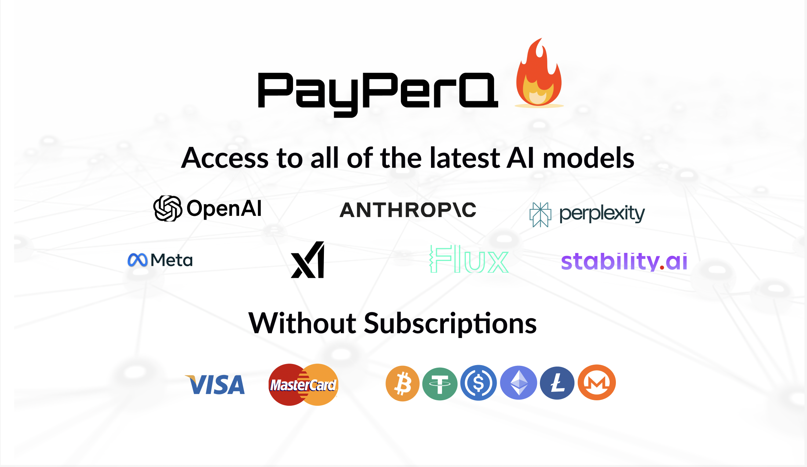

# PPQ Privacy Verifier

PPQ.AI, as of September 29th, 2026, is by default blind to the content of
user chat queries through the use of AWS Nitro enclaves. This repository is an
optional add-on tool for cryptographically verifying that the privacy promised
in the previous sentence is actually happening.

## How PPQ's enclave router works

Every chat request to PPQ.AI is now served inside an AWS Nitro enclave: your
prompt is encrypted before it leaves your device and is not decrypted until it
reaches an enclave. PPQ's own backend sees a credit check and billing
metadata, never your content.

The enclave's code is open source and reproducibly built. The code in this
repo runs on your machine. When it starts, it checks that the enclave it is
about to talk to is running that published code, and every request it then
sends is encrypted to a key that only that verified enclave holds, so you do
not have to take PPQ's word for it.

## What the enclave keeps PPQ (and the enclave host, AWS) from doing

**Reading or keeping your queries.** Your request is decrypted only inside
the enclave. PPQ's backend and PPQ's logs never see the request content at
all, only the billing metadata the enclave reports. There is nothing to
harvest, sell or hand over: PPQ cannot release the content of your queries to
a third party, or produce it under a subpoena, because it never holds it in
an extractable way. Billing metadata (which model, how many tokens, when) is
the one thing PPQ does keep.

**Altering the answers.** The provider's response is decrypted inside the
enclave and then encrypted back to you, the user. PPQ cannot change a word,
and the only code that handles the reply in the clear is the published,
measured code anyone can read. This is not a hypothetical concern: a 2026
study, [*Your Agent Is Mine*](https://arxiv.org/abs/2604.08407), found AI
routers in the wild injecting malicious code into responses and exfiltrating
credentials from the requests passing through them.

**The same goes for AWS.** The enclave runs on AWS hardware, and AWS cannot
read or manipulate it either. The Nitro System is built so that no AWS
operator, however privileged, can log in to the host or read or write to the
memory of what runs on it, and AWS states that this holds
["including in fulfillment of a law enforcement request"](https://docs.aws.amazon.com/whitepapers/latest/overview-aws-european-sovereign-cloud/introduction.html).
The design is described in
[*The Security Design of the AWS Nitro System*](https://docs.aws.amazon.com/whitepapers/latest/security-design-of-aws-nitro-system/security-design-of-aws-nitro-system.html)
and was independently reviewed by
[NCC Group](https://www.nccgroup.com/research-blog/public-report-aws-nitro-system-api-security-claims/),
who "found no gaps in the Nitro System that would compromise these security
claims."

**Quietly serving a different model from the one the user requested.** The
worry is that you, the user, ask for Claude and PPQ secretly serves you a
cheaper, less capable model instead. This happens. In September 2026 an
[independent investigation](https://kendell.dev/blog/crofaifalse/) found
that CrofAI, which sold access to models like Kimi K3 at prices nobody else
could match, was answering those requests with smaller, cheaper models such
as GLM 5.3 Flash, bought from OpenRouter and returned under the Kimi K3
label. OpenRouter served exactly what CrofAI asked it for; the swap was
CrofAI's. Its owner admitted to part of it, the company is now
[shutting down and refunding customers](https://www.nahcrof.com/), and
within two weeks a second cheap provider was
[publicly defending itself](https://x.com/Entelic_Aria/status/2103904103705559401)
against the same accusation. As one observer
[put it](https://x.com/zachmoskow/status/2099574648799125524): "If you
cannot tell a customer exactly who is serving their inference, what model
they are receiving, and where their data goes when capacity fails, you are
not selling inference." The enclave rules that out in two ways.

First, its code binds each model family to its provider, with OpenRouter as
the only fallback: a request for a Claude model can go to Anthropic or to
OpenRouter, and nowhere else, and likewise for GPT, Gemini and others.

Second, every streamed response carries a **routing receipt**: a line, signed
by the enclave with a key its attestation commits to, stating the model you
asked for, the provider the enclave actually connected to, and the exact
model id it sent there. It rides inside the encrypted response, so nothing
outside the enclave can alter it, and it is a comment line that
OpenAI-compatible clients ignore unless they look for it.

Attestation proves the enclave is running the published code; the receipt
proves where that code sent your request. Between them there is no room for
a quiet swap, and you never have to trust that PPQ delivered the model and
provider you paid for. The only trust left is in the provider itself. When a
request went through OpenRouter, the receipt says so; in that case
OpenRouter, not PPQ, picks the underlying provider, and the receipt's
guarantee stops at OpenRouter's door. To verify a receipt against the
enclave's attestation yourself, use
[`verify-receipt.mjs`](https://github.com/PayPerQ/ppq-enclave-proxy/blob/main/client/verify-receipt.mjs)
from the enclave repository.

## What this "PPQ Privacy Verifier" repo actually does

It is a small proxy you run on your own machine. Point any OpenAI- or
Anthropic-compatible client at it instead of at PPQ directly.

When it starts, it fetches the enclave's attestation and checks it against
the published code measurement. If they do not match, it refuses to send
anything. If they do, every request you make is encrypted to a key that only
that verified enclave holds, and the response is decrypted back on your
machine.

You get the same privacy without it: every request enters the enclave either
way. What the proxy adds is that *you* checked the enclave, rather than
trusting PPQ to have done it.

## What about fully end-to-end encrypted TEE models?

### What are TEE models?

Private TEE models are open-weight models, such as Kimi and GLM, that PPQ
serves from inside a [Tinfoil](https://tinfoil.sh) enclave. The model itself
runs inside the TEE. Your prompt is decrypted only there, and the answer is
encrypted there before it leaves. Nobody sees the content of your queries:
not PPQ, and not even the provider, Tinfoil. These are the models PPQ labels
**E2EE**. Read more about them in our blog post,
[*Introducing Private AI Models*](https://ppq.ai/blog/introducing-tee-models).

### How do TEE models differ from the TEE router?

The TEE router is PPQ's Nitro enclave, described above. It keeps your prompt
from PPQ, but it has to hand the prompt to the model's provider in the clear,
because that is where Claude or GPT actually runs. The provider sees your
prompt.

With a TEE model the provider is Tinfoil, and Tinfoil cannot read your prompt
or the answer either. The enclave your prompt is decrypted in is the one
running the model, so the only machine that ever holds your plaintext is the
one producing your answer.

### How are TEE models processed in conjunction with the TEE router?

A `private/*` request still enters PPQ's Nitro enclave first, like every
other request: that is where your credit is checked and the request is
billed. From there it goes on to Tinfoil's enclave. How much the Nitro
enclave sees on the way depends on which of two paths you take.

**Path 1: you use this repo.** The proxy verifies Tinfoil's attestation on
your machine and encrypts your request directly to Tinfoil's key. PPQ's Nitro
enclave receives ciphertext it cannot open, relays it to Tinfoil, and bills
your key from the token counts Tinfoil reports. Your plaintext exists in
exactly two places: your machine and Tinfoil's enclave.

**Path 2: you send a plain request, without client-side EHBP.** The request
is decrypted inside PPQ's Nitro enclave, which then verifies Tinfoil's
attestation itself, encrypts your prompt to Tinfoil's key, and forwards it.
Your plaintext passes briefly through the Nitro enclave, inside measured code
that neither PPQ nor AWS can read, on its way to Tinfoil.

Both paths end in the same place, and on both PPQ is blind. The difference is
who verified Tinfoil: on path 1, you did; on path 2, PPQ's enclave did it on
your behalf.

## How other parts of PPQ's architecture aid in privacy

PPQ has no accounts. You do not sign up, and giving an email address is
optional. You buy credits, you get a credit id, and that id is all PPQ needs
to serve you. Most users buy those credits with cryptocurrency: Bitcoin
(on-chain or Lightning), Monero, stablecoins and other coins.

Put together with the enclave, that splits what anyone can know about you
into pieces that never meet:

- **PPQ** knows a credit id, how it was funded, and billing metadata: which
  model, how many tokens, when. If the credits were bought with crypto, none
  of that points at a person.
- **The model's provider** (Anthropic, Google, and so on) sees your prompt,
  but the request arrives from PPQ's enclave under PPQ's credentials. The
  provider sees PPQ, not you.\*
- **Tinfoil**, for private TEE models, sees neither your prompt nor you.

So the party that could read your prompt does not know who you are, and the
party that knows how you paid cannot read your prompt. The content and the
identity never sit in the same place.

Two caveats. Paying by card attaches your card details to your credit id at
PPQ, though still not at the provider; pay with crypto if that matters to
you. And your IP address is visible to PPQ's network edge like any web
request, so use a VPN if you want that hidden too.

\* OpenAI is currently the one exception. It requires a per-customer
identifier on every request, so that one user's policy violation is scoped
to that user rather than to all of PPQ. For OpenAI models the enclave
attaches a keyed hash of your credit id. OpenAI can tell that a set of
requests came from the same customer, but cannot turn the hash back into a
credit id, let alone a person. Other providers may add the same requirement
in the future; if they do, PPQ will handle it the same way, and any such
change will be reflected in this note and in PPQ's
[Terms of Service](https://ppq.ai/terms) and
[Privacy Policy](https://ppq.ai/privacy).
