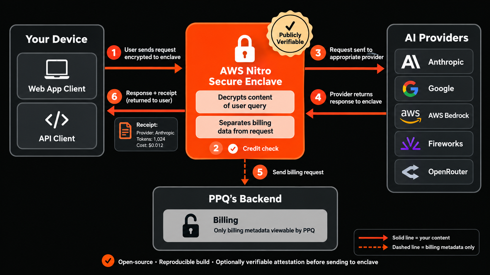

# PPQ Privacy Verifier

PPQ.AI, as of September 29th, 2026, is by default blind to the content of
user chat queries through the use of AWS Nitro enclaves. This repository is an
optional add-on tool for cryptographically verifying that the privacy promised
in the previous sentence is actually happening.

Every chat request to PPQ.AI is now served inside an AWS Nitro enclave: your
prompt is encrypted before it leaves your device and is not decrypted until it
reaches an enclave. PPQ's own backend sees a credit check and billing
metadata, never your content.

The enclave's code is open source and reproducibly built. This proxy runs on
your machine. When it starts, it checks that the enclave it is about to talk
to is running that published code, and every request it then sends is
encrypted to a key that only that verified enclave holds, so you do not have
to take PPQ's word for it.

## Which enclave decrypts your prompt

That depends on the model.

For frontier models such as Claude, GPT and Gemini, it is PPQ's Nitro
enclave. The enclave decrypts your prompt and forwards it to the model's
provider, so the provider sees it. PPQ does not.

For `private/*` models, the model itself runs inside a
[Tinfoil](https://tinfoil.sh) enclave, and your prompt is decrypted only
there. Nobody but you sees it: not PPQ, and not Tinfoil.

## What the enclave keeps PPQ (and the enclave host, AWS) from doing

**Reading or keeping your queries.** Your connection is decrypted only inside
the enclave. The servers around it see ciphertext; PPQ's backend and PPQ's
logs never see the connection at all, only the billing metadata the enclave
reports. There is nothing to harvest, sell or hand over: PPQ cannot
release the content of your queries to a third party, or produce it under a
subpoena, because it never holds it. Billing metadata (which model, how many
tokens, when) is the one thing PPQ does keep.

**Altering the answers.** The provider's response is decrypted inside the
enclave and encrypted to you again there. Nothing outside it can change a
word, and the only code that handles the reply in the clear is the published,
measured code anyone can read. This is not a hypothetical concern: an ordinary
API router is a plaintext proxy, and a 2026 study,
[*Your Agent Is Mine*](https://arxiv.org/abs/2604.08407), found routers in
the wild injecting malicious code into responses and exfiltrating credentials
from the requests passing through them.

**Quietly serving a different model.** The enclave cannot stop PPQ's backend
from choosing a provider, but it reports the choice in a signed receipt,
described next.

**The same goes for AWS.** The enclave runs on AWS hardware, and AWS cannot
read it either. The Nitro System is built so that no AWS operator, however
privileged, can log in to the host or read the memory of what runs on it,
and AWS states that this holds
["including in fulfillment of a law enforcement request"](https://docs.aws.amazon.com/whitepapers/latest/overview-aws-european-sovereign-cloud/introduction.html).
The design is described in
[*The Security Design of the AWS Nitro System*](https://docs.aws.amazon.com/whitepapers/latest/security-design-of-aws-nitro-system/security-design-of-aws-nitro-system.html)
and was independently reviewed by
[NCC Group](https://www.nccgroup.com/research-blog/public-report-aws-nitro-system-api-security-claims/),
who "found no gaps in the Nitro System that would compromise these security
claims."

## A receipt for every request

The enclave does not choose which provider serves your request; PPQ's backend
does, at the credit check. So attestation alone cannot tell you that your
request went to the model you paid for rather than a cheaper one.

For that, every streamed response carries a **routing receipt**: a line,
signed by the enclave with a key its attestation commits to, stating the model
you asked for, the provider the enclave actually connected to, and the model
id it sent there. It rides inside the encrypted response, so nothing outside
the enclave can alter it, and it is a comment line that OpenAI-compatible
clients ignore unless they look for it.

A receipt does not stop PPQ from substituting a model. It makes any
substitution undeniable: the statement comes from published, measured code and
can be checked against source anyone can read. When a request went through
OpenRouter, the receipt says so; in that case OpenRouter, not PPQ, picks the
underlying provider. To verify a receipt against the enclave's attestation
yourself, use
[`verify-receipt.mjs`](https://github.com/PayPerQ/ppq-enclave-proxy/blob/main/client/verify-receipt.mjs)
from the enclave repository.

## What the proxy does

Point any OpenAI- or Anthropic-compatible client at it. When the proxy starts,
it verifies the enclave's attestation against the published code measurement.
Every request that leaves your computer is then encrypted to a key only that
verified enclave holds. Which enclave depends on the model.

### Frontier models: Claude, GPT, Gemini, …

The proxy verifies PPQ's Nitro enclave and encrypts your query to it. The
enclave forwards the query to the model's provider.

PPQ cannot read your query. The provider can.

### `private/*` models

These models run inside a [Tinfoil](https://tinfoil.sh) enclave. The proxy
verifies that enclave and encrypts your query to it. PPQ's enclave relays the
ciphertext and bills your key; it cannot read the query.

Nobody but you can read your query. Not PPQ, and not Tinfoil.

## Without the proxy

You get the same privacy without it. A plain API request still enters PPQ's
enclave, and for `private/*` models the enclave verifies Tinfoil and encrypts
to it on your behalf. What the proxy adds is that *you* did the verifying.
